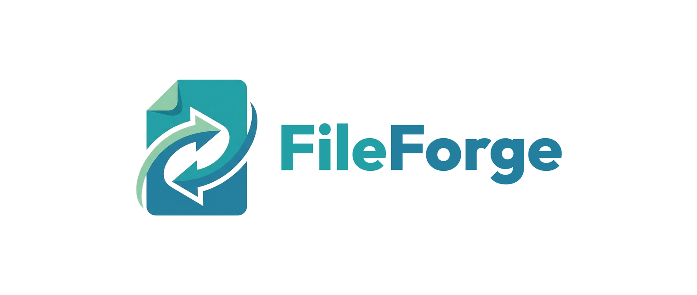

<p align="center">
	<a href="https://react.dev/"></a>
	<a href="https://www.typescriptlang.org/"></a>
	<a href="https://vitejs.dev/"></a>
	<a href="https://tailwindcss.com/"></a>
	<a href="https://nodejs.org/"></a>
	<a href="https://expressjs.com/"></a>
</p>

# FileForge

FileForge is a lightweight, ad-free file conversion and manipulation tool. It handles everyday tasks like document conversion, image conversion, and PDF management from a single place, without accounts, ads, or stored files.

Most processing happens directly in the browser. The backend only steps in for the handful of conversions a browser genuinely cannot do on its own.

---

## 🌟 Key Features

- **📄 Document conversion:** Word to PDF and PDF to Word, with common documents converted entirely client-side.
- **🖼️ Image conversion:** PNG, JPG, and SVG, in any direction.
- **📎 PDF tools:** Stitching, splitting, and compression.
- **🎨 Media tools:** Image compression and AI-powered background removal, both running locally in the browser via WebAssembly.
- **🖥️ Simple interface:** A collapsible sidebar lists all eight tools, with light, dark, and system theme support.
- **🔐 No data retention:** No database, no file storage, no accounts. Every file exists only for the duration of the request that processes it.

---

## 🏗️ Tech Stack

**Frontend**
- `React` + `TypeScript`, built with `Vite`
- `Tailwind CSS` v4, with a brand color scale and light/dark/system theming
- `pdf-lib`, `@imgly/background-removal`, `browser-image-compression` for client-side file processing
- `lucide-react` for icons

**Backend**
- `Node.js` + `Express`, written in TypeScript
- `LibreOffice` (headless) for Word documents the browser can't fully handle
- `Ghostscript` for heavier PDF compression
- A single-job queue to keep resource use predictable on limited infrastructure

See [`frontend/README.md`](./frontend/README.md) and [`backend/README.md`](./backend/README.md) for details on each service.

---

## 📁 Project Structure

```
FileForge/
├── frontend/       # React app, most conversions happen here (organized by feature, see frontend/README.md)
├── backend/        # Express API for LibreOffice and Ghostscript conversions
└── .github/        # CI workflows and issue/PR templates
```

---

## 🚀 Getting Started

Each service is self-contained and documented separately:

1. Set up the frontend: see [`frontend/README.md`](./frontend/README.md)
2. Set up the backend: see [`backend/README.md`](./backend/README.md)

The project currently runs locally only. Deployment instructions will be added once all features are working end to end.

---

## ⚠️ Known Limitations

- **PDF to Word with Arabic, Hebrew, or other right-to-left text:** LibreOffice's PDF import filter reconstructs PDF text as many small, absolutely-positioned floating text boxes instead of normal flowing paragraphs. This happens with any PDF, but right-to-left and other complex-script content fragments far more heavily, sometimes into hundreds of overlapping text boxes on a single page. The resulting Word document can look messy and may be slow or unstable to open. This is a limitation of LibreOffice's PDF import itself, not something the FileForge backend controls. Until an alternative conversion path is built, PDF to Word gives the most reliable results on PDFs with primarily Latin-script text.

---

## 🤝 Contributing

Contributions are welcome. Please read [`CONTRIBUTING.md`](./CONTRIBUTING.md) for setup steps, coding conventions, and the pull request process, and note that this project follows a [Code of Conduct](./CODE_OF_CONDUCT.md).

1. Fork the project.
2. Create a feature branch (`git checkout -b feature/your-feature-name`).
3. Commit your changes.
4. Push to your branch and open a pull request.

---

## 🔒 Security

If you find a vulnerability, please do not open a public issue. See [`SECURITY.md`](./SECURITY.md) for how to report it.

---

## 📄 License

This project is licensed under the GNU General Public License v3.0. See the [`LICENSE`](./LICENSE) file for the full text.